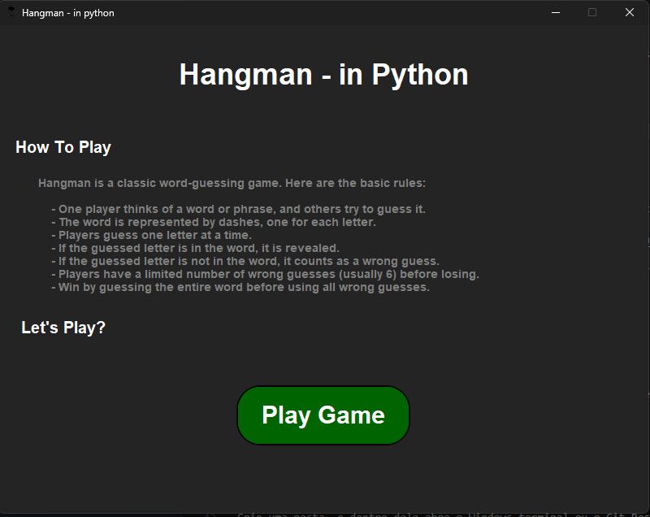

# Hangman - in Python




> The Hangman game is a classic word-guessing game where players try to guess a hidden word by suggesting letters within a certain number of guesses. The project aims to implement this game in Python, offering an interactive console-based experience. It is designed for entertainment and educational purposes, making it a great way to practice Python programming and game development.

Submit bug reports and feature suggestions, or track changes in the [issue queue](https://www.example.com/issues).

### Ajustes e melhorias

O projeto ainda está em desenvolvimento e as próximas atualizações serão voltadas nas seguintes tarefas:

- [x] Implementar a lógica básica do jogo
- [x] Adicionar interface gráfica com customtkinter
- [x] Implementar imagens de feedback visual
- [ ] Melhorar a experiência do usuário com mensagens de feedback
- [ ] Adicionar suporte a diferentes níveis de dificuldade

## 💻 Pré-requisitos

Antes de começar, verifique se você atendeu aos seguintes requisitos:

- Você instalou a versão mais recente do [Python](https://www.python.org/downloads/). `<[Python 3.12.4]>`
- Você tem uma máquina `<Windows / Linux / MacOS>`.
<!-- - Você leu `<guia / link / documentação_relacionada_ao_projeto>`. -->

## 🚀 Instalando Hangman

Para instalar o Hangman, siga estas etapas:

Linux e macOS:

Crie uma pasta, e dentro dela abra o terminal e escreva o seguinte comando:

```bash
git clone https://github.com/MateusRabelo/python-hangman.git
pip install -r requirements.txt
```
Windows:

Crie uma pasta, e dentro dela abra o Windows terminal ou o Git Bash e escreva o seguinte comando:

```bash
git clone https://github.com/MateusRabelo/python-hangman.git
pip install -r requirements.txt
```


## ☕ Usando Hangman - in Python

Para usar Hangman - in Python, siga estas etapas:

Linux e macOS:

`Abra o aplicativo <app.py>`

ou

`Escreva no Windows Terminal ou Git Bash`

```bash
python3.exe app.py
```

Windows:

`Abra o aplicativo <app.py>`

ou

`Escreva no Windows Terminal ou Git Bash`

```bash
python.exe app.py
```

Adicione comandos de execução e exemplos que você acha que os usuários acharão úteis. Fornece uma referência de opções para pontos de bônus!

## 📫 Contribuindo para Hangman - in Python

Para contribuir com Hangman - in Python, siga estas etapas:

1. Bifurque este repositório.
2. Crie um branch: `git checkout -b main`.
3. Faça suas alterações e confirme-as: `git commit -m '<mensagem_commit>'`
4. Envie para o branch original: `git push origin python-hangman main`
5. Crie a solicitação de pull.

Como alternativa, consulte a documentação do GitHub em [como criar uma solicitação pull](https://help.github.com/en/github/collaborating-with-issues-and-pull-requests/creating-a-pull-request).

<!--
## 📝 Licença

Esse projeto está sob licença. Veja o arquivo [LICENÇA](LICENSE.md) para mais detalhes.
-->